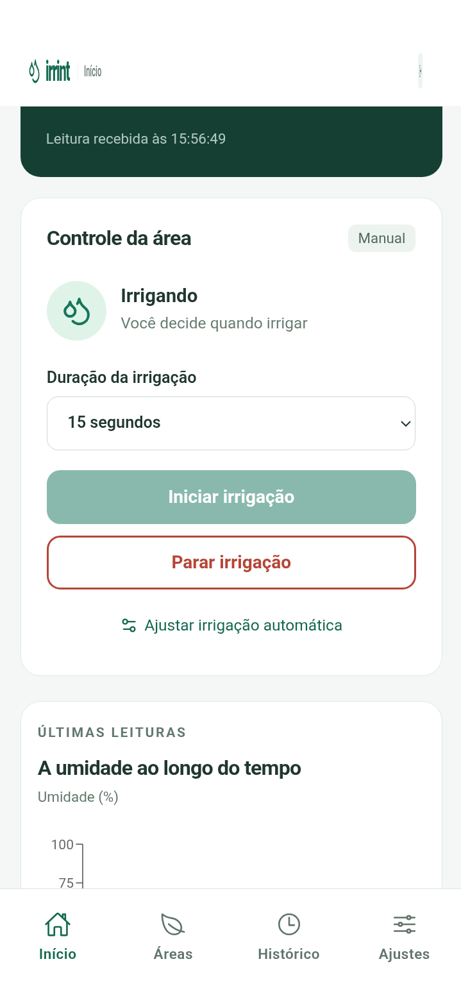
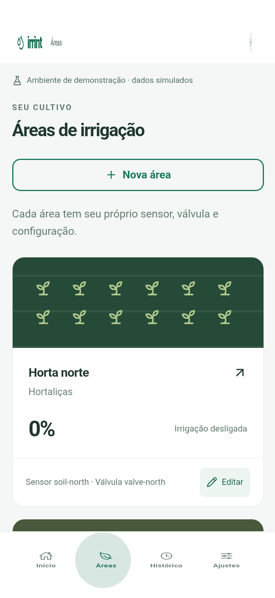
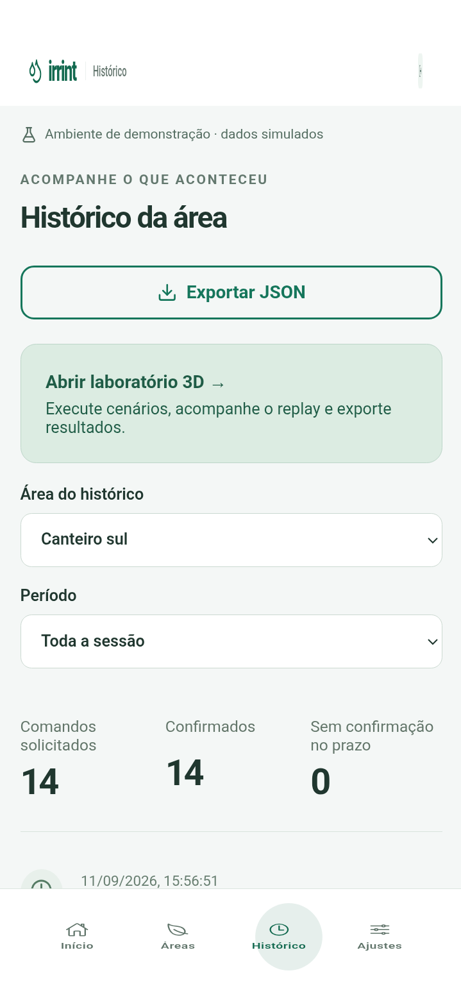
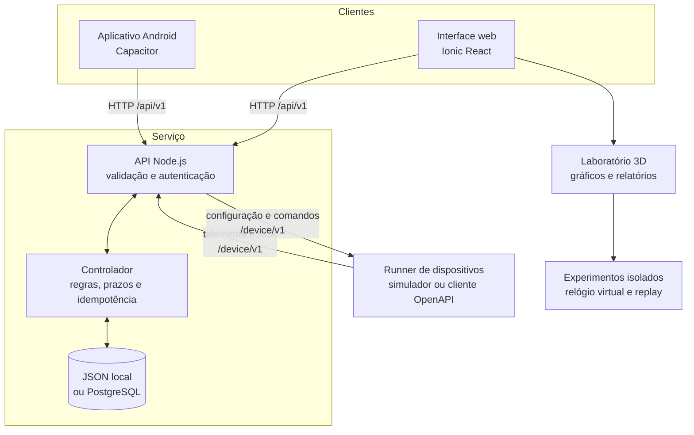

# Irrint — Irrigação Inteligente

[](package.json)
[](package.json)
[](https://ionicframework.com/docs/react)
[](https://capacitorjs.com/docs)
[](CONTRATO.md)

Aplicativo híbrido, API e ambiente de simulação para monitorar e controlar sistemas de irrigação. O projeto foi desenvolvido como protótipo de TCC e demonstra, sem exigir hardware físico, como um produtor poderia acompanhar a umidade, configurar regras, acionar válvulas e analisar falhas por uma interface mobile.

> **Situação atual:** a versão `0.4.2` possui APK público assinado, ligado à API HTTPS hospedada e sem configuração de IP. A Vercel continua em [irrigacao-int.vercel.app](https://irrigacao-int.vercel.app/). Um segundo APK, identificado como **Irrint Contingência**, mantém a operação em rede local e pode coexistir no mesmo Android.

<p align="center">
  
  
  
</p>

## Sumário

- [O que o projeto demonstra](#o-que-o-projeto-demonstra)
- [Funcionalidades](#funcionalidades)
- [Arquitetura](#arquitetura)
- [Tecnologias](#tecnologias)
- [Início rápido](#início-rápido)
- [Como usar o sistema](#como-usar-o-sistema)
- [Laboratório 3D e testes simulados](#laboratório-3d-e-testes-simulados)
- [Modos de execução](#modos-de-execução)
- [APK público](#apk-público)
- [Contingência local com APK](#contingência-local-com-apk)
- [Contrato HTTP e integração de dispositivos](#contrato-http-e-integração-de-dispositivos)
- [Configuração por variáveis de ambiente](#configuração-por-variáveis-de-ambiente)
- [Testes e evidências](#testes-e-evidências)
- [Android](#android)
- [Publicação](#publicação)
- [Dados, autenticação e segurança](#dados-autenticação-e-segurança)
- [Estrutura do repositório](#estrutura-do-repositório)
- [Limites do protótipo](#limites-do-protótipo)
- [Solução de problemas](#solução-de-problemas)
- [Documentação complementar](#documentação-complementar)
- [Versões, contribuição e licença](#versões-contribuição-e-licença)

## O que o projeto demonstra

O Irrint investiga a viabilidade de uma aplicação mobile para irrigação com três partes desacopladas:

1. **Aplicativo do produtor:** apresenta áreas, leituras, regras, comandos, histórico e resultados.
2. **API de controle:** valida dados, decide quando irrigar, registra comandos e aguarda confirmação.
3. **Dispositivo:** publica telemetria, executa ou rejeita comandos e informa o estado observado da válvula.

Na versão atual, a terceira parte é executada por processos simulados. Isso permite repetir ensaios, apresentar situações de falha e integrar outro cliente pelo contrato OpenAPI. Um futuro ESP32, microcontrolador ou gateway poderá ocupar esse papel se implementar o contrato e receber a adaptação elétrica e de firmware necessária.

O escopo entregue sustenta a demonstração do **aplicativo híbrido, do contrato HTTP, da lógica de controle e do simulador**. Ele não afirma economia real de água, eficiência agronômica, compatibilidade universal com componentes ou validação de campo.

## Funcionalidades

### Operação

- Interface mobile com **Início**, **Áreas**, **Histórico** e **Ajustes**.
- Autenticação demonstrativa com sessão de 30 minutos.
- Duas áreas iniciais independentes: Horta norte e Canteiro sul.
- Cadastro e edição de áreas com identificadores próprios de dispositivo, sensor e válvula.
- Umidade atual, idade da leitura, conectividade, estado da válvula e consumo nominal.
- Abertura manual com duração definida e solicitação de parada prioritária.
- Controle automático com limiares de início e parada, histerese e tempo máximo.
- Histórico de leituras, comandos, confirmações e eventos.
- Exportação do estado e de relatórios em JSON, CSV e HTML para impressão.

### Integridade do controle

- Comandos com chave de idempotência para impedir execução duplicada.
- Estado explícito: `pending`, `applied`, `rejected`, `expired` ou `superseded`.
- Confirmação de execução por ACK e telemetria coerente.
- Expiração de comando quando o dispositivo não responde dentro do prazo.
- Watchdog no dispositivo simulado para fechar a válvula ao final da duração.
- Suspensão do automático após parada manual ou encerramento de segurança.
- Rejeição de leituras inválidas, antigas ou fora de sequência.
- Estado incerto quando a comunicação ou a confirmação não permite afirmar a condição atual.

### Apresentação e evidências

- Maquete Three.js com reservatório, bomba, tubulações e dois sistemas de cultivo.
- Modelos identificáveis de microcontrolador/relé, válvula, sensor capacitivo e gotejadores.
- Etiquetas opcionais ligadas aos componentes e inspetor 3D com rotação automática.
- Gotejamento opcional, corte do solo e representação visual da umidade.
- Oito cenários reproduzíveis, disponíveis para os sistemas norte e sul.
- Replay com pausa, avanço, velocidade 10× e reinício.
- Gráficos, cronologia, critérios verificáveis e comparação de resultados.
- Alternativa textual quando WebGL não estiver disponível.

Recursos antigos de IA, previsões climáticas fixas e dependência do Firebase foram removidos do fluxo atual porque não fazem parte do escopo consolidado.

## Arquitetura



O navegador não controla a válvula diretamente. Ele solicita uma ação à API, que registra o comando como pendente. O runner consulta esse comando, altera o dispositivo simulado, envia o ACK e publica uma nova leitura. Só então a interface apresenta a execução como confirmada.

Os experimentos do laboratório usam novas instâncias do domínio e um relógio virtual de 1 segundo. Eles não alteram as áreas da sessão ao vivo. A maquete, os gráficos e o replay visualizam resultados previamente calculados; mover a câmera ou pausar a animação não produz comandos nem altera o consumo.

### Decisões de projeto

| Decisão                                         | Motivo                                                                                 |
| ----------------------------------------------- | -------------------------------------------------------------------------------------- |
| Contrato validado com Zod e descrito em OpenAPI | Manter aplicativo, API e dispositivo substituíveis e detectar mensagens incompatíveis. |
| Dispositivo em processo separado                | Demonstrar que fechar a interface não encerra o controle ou o watchdog.                |
| ACK separado do recebimento HTTP                | Diferenciar “pedido recebido” de “ação executada”.                                     |
| Idempotência e sequência de telemetria          | Evitar repetições de comando e regressão para leituras antigas.                        |
| Estado incerto explícito                        | Evitar que ausência de comunicação seja apresentada como válvula fechada.              |
| JSON recuperável no modo local                  | Manter a demonstração simples, persistente e auditável.                                |
| PostgreSQL no modo hospedado                    | Persistir visitantes isolados em uma implantação externa de instância única.           |
| Simulação determinística por seed               | Permitir que a banca repita e compare os mesmos ensaios.                               |
| Modelos 3D procedurais                          | Evitar dependência de ativos externos e manter relação direta com os dados do ensaio.  |

## Tecnologias

| Camada                | Tecnologias principais                              |
| --------------------- | --------------------------------------------------- |
| Interface             | React 18, TypeScript, Ionic React 9, React Router 6 |
| Aplicativo híbrido    | Capacitor 8, Android SDK 36                         |
| Visualização          | Three.js, Recharts                                  |
| Contratos e validação | Zod, OpenAPI 3.1                                    |
| API e processos       | Node.js, TypeScript, `node:http`, TSX               |
| Persistência          | JSON com cópia de segurança ou PostgreSQL           |
| Testes                | Vitest e Playwright                                 |
| Build                 | Vite 6, TypeScript 5                                |
| Distribuição          | Vercel, Heroku/Render, Docker                       |

## Início rápido

### Requisitos

- [Node.js 22](https://nodejs.org/) e npm.
- Git para clonar e consultar as versões.
- Windows, Linux ou macOS para a execução web local.
- Chromium instalado pelo Playwright somente para os testes E2E.

Clone o projeto e instale as versões registradas no `package-lock.json`:

```sh
git clone https://github.com/Johanshs/irrint.git
cd irrint
npm ci
```

Inicie a API, o simulador e a interface:

```sh
npm run demo:start
```

Abra [http://127.0.0.1:5173](http://127.0.0.1:5173) e entre com a conta sintética:

```text
E-mail: produtor@demo.local
Senha:  irrigacao
```

O comando mantém três processos sob o mesmo supervisor:

- API em `http://127.0.0.1:8787`;
- runner com os dispositivos simulados;
- interface Vite em `http://127.0.0.1:5173`.

Use `Ctrl+C` no terminal para encerrar todo o conjunto.

## Como usar o sistema

### 1. Entrar

Use as credenciais demonstrativas. No APK de contingência também aparece o campo **Conexão local de contingência**, usado para indicar o endereço da API no notebook.

### 2. Acompanhar a operação

Em **Início**, selecione uma área e confira umidade, conectividade, última leitura, estado operacional e consumo acumulado. Uma leitura antiga continua no histórico, mas não é tratada como confirmação do estado atual.

Para testar o modo manual:

1. escolha Horta norte ou Canteiro sul;
2. solicite a irrigação e informe a duração;
3. observe o comando pendente;
4. aguarde a confirmação e a mudança para **Irrigando**;
5. solicite a parada e confirme a nova telemetria.

### 3. Cadastrar ou editar áreas

Em **Áreas**, informe o nome e o cultivo. A API gera identificadores diferentes para a área, o dispositivo, o sensor e a válvula. O runner consulta a configuração periodicamente e começa a simular o novo conjunto sem configuração técnica adicional.

A versão atual cria e edita áreas. Remoção, substituição de componentes e migração do histórico para novos vínculos permanecem fora do fluxo entregue.

### 4. Configurar o automático

Em **Ajustes**, escolha uma área, ative o modo automático e configure:

- **Iniciar abaixo de:** umidade que solicita abertura;
- **Parar em:** umidade que solicita fechamento;
- **Duração máxima:** limite entre 5 e 600 segundos.

O limite de início precisa ser menor que o limite de parada. O valor padrão didático abre abaixo de 35% e para em 45%. Salvar novamente o modo automático retoma a regra quando ela tiver sido suspensa por uma parada manual ou de segurança.

### 5. Consultar e exportar

Em **Histórico**, filtre os registros e acompanhe leituras, pedidos, confirmações, rejeições e expirações. O relatório ao vivo distingue valores medidos de valores ausentes; falta de telemetria aparece como `not-measured`, e não como zero.

Use a exportação para conservar a execução antes de iniciar uma sessão nova ou atingir os limites de retenção.

## Laboratório 3D e testes simulados

Abra **Histórico → Laboratório** e siga o fluxo único:

1. escolha o **Sistema** norte ou sul;
2. escolha o **Teste**;
3. pressione **Executar teste**;
4. percorra **Maquete 3D**, **Entender o teste** e **Resultados**.

Na maquete:

- **Mostrar nomes** exibe etiquetas ligadas aos componentes;
- **Animar gotejamento** controla apenas o efeito visual;
- tocar ou clicar em um componente abre o inspetor em rotação automática;
- o corte do solo relaciona a aparência do canteiro ao índice de umidade;
- indicadores mostram umidade, volume total, aplicação média por planta e vazão;
- o sistema não selecionado permanece como controle de isolamento.

### Cenários disponíveis

| Cenário                | O que permite observar                                                             |
| ---------------------- | ---------------------------------------------------------------------------------- |
| Automático             | Abertura abaixo do limite e parada ao atingir a umidade configurada.               |
| Parada manual          | Prioridade do operador e suspensão posterior da regra automática.                  |
| Perda de comunicação   | Watchdog fecha internamente, enquanto a API conserva a última informação recebida. |
| Confirmação perdida    | Água pode ter sido liberada mesmo sem o ACK chegar à API.                          |
| Comando vencido        | O pedido não chega ao dispositivo e expira sem consumo.                            |
| Repetição              | A mesma chave de idempotência não produz uma segunda execução.                     |
| Leitura inválida       | Amostras incorretas são recusadas sem substituir a última leitura válida.          |
| Válvula travada aberta | O fechamento é rejeitado, o estado fica incerto e o fluxo interno continua.        |

Cada cenário possui três critérios derivados de comandos, leituras, eventos e estado interno. Com os dois sistemas, o conjunto gera **48 critérios em 16 ensaios**. Zero consumo ou zero confirmações pode ser o resultado correto de um teste; a aprovação depende do comportamento esperado para aquele cenário.

O roteiro detalhado, os valores de referência e a explicação das falhas estão em [DEMONSTRACAO-3D.md](DEMONSTRACAO-3D.md).

## Modos de execução

| Comando                        | Uso                                                                        |
| ------------------------------ | -------------------------------------------------------------------------- |
| `npm run demo:start`           | Demonstração completa limitada ao próprio computador.                      |
| `npm run demo:start:lan`       | Demonstração acessível na rede privada para o APK Android.                 |
| `npm run demo:start:reference` | Troca o simulador pelo cliente independente derivado do OpenAPI.           |
| `npm run contingency:start`    | Inicia o modo LAN e mostra os endereços que o APK pode usar.               |
| `npm run android:public`       | Gera o APK público assinado com a API HTTPS fixa.                          |
| `npm run start:hosted`         | API pública, armazenamento configurado e runner OpenAPI sob um supervisor. |
| `npm run dev`                  | Somente a interface; pressupõe uma API já ativa.                           |
| `npm run demo:api`             | Somente a API local.                                                       |
| `npm run demo:device`          | Somente o simulador padrão.                                                |
| `npm run client:device`        | Somente o cliente OpenAPI de referência.                                   |

`demo:start` é a opção indicada para desenvolvimento e apresentação no notebook. O modo LAN precisa ser ativado explicitamente.

## APK público

O APK público usa a API hospedada declarada em `.env.production`. Ele não exibe a seção de configuração de IP e recusa endpoints sem HTTPS durante a compilação.

**Download:** [Irrint 0.4.2 — APK público](https://github.com/Johanshs/irrint/releases/download/v0.4.2/Irrint-0.4.2-publico.apk)

```powershell
npm run android:public
```

O artefato é gravado em `distribution/Irrint-0.4.2-publico.apk`, acompanhado pelo SHA-256. No primeiro build, o comando cria uma identidade de assinatura local. Preserve juntos, em backup privado, `android/irrint-release.jks` e `android/keystore.properties`: futuras atualizações do aplicativo público precisam da mesma chave.

Identificador Android: `br.com.irrint.app`. Credenciais da demonstração: `produtor@demo.local` / `irrigacao`.

## Contingência local com APK

Esse modo mantém a apresentação funcional mesmo sem acesso externo à internet. Ele exige que o projeto e `node_modules` já estejam presentes no notebook.

### Preparar antes da apresentação

No notebook com Node.js, Android SDK e Java configurados:

```powershell
npm ci
npm run contingency:build
```

O processo:

1. executa a validação TypeScript e o build Vite;
2. sincroniza os arquivos com o Capacitor;
3. compila o APK Android de depuração;
4. copia o artefato para `contingency/Irrint-contingencia-debug.apk`;
5. grava o SHA-256 ao lado do arquivo.

O endereço inicial é `http://192.168.137.1:8787`, comum ao ponto de acesso móvel do Windows. Para incorporar outro endereço inicial:

```powershell
npm run contingency:build -- --api=http://192.168.1.20:8787
```

O endereço continua editável na tela de login do APK. Esta variante usa o identificador `br.com.irrint.contingency` e o nome **Irrint Contingência**, portanto pode ficar instalada ao lado da versão pública.

### Usar no dia

1. instale `contingency/Irrint-contingencia-debug.apk` no Android;
2. conecte notebook e celular ao mesmo Wi-Fi ou ponto de acesso local;
3. execute `npm run contingency:start` ou abra `contingency/Iniciar-Irrint.ps1`;
4. permita o Node.js em redes privadas se o Firewall do Windows solicitar;
5. mantenha o PowerShell aberto;
6. copie para o APK um endereço mostrado, como `http://192.168.1.20:8787`;
7. entre com `produtor@demo.local` / `irrigacao`.

Não use `127.0.0.1` no celular: esse endereço representa o próprio aparelho. Para testar a conexão pelo navegador Android, abra `http://IP-DO-NOTEBOOK:8787/healthz`.

Sem o celular, a interface continua disponível em `http://127.0.0.1:5173` no notebook. Veja o procedimento compacto em [contingency/LEIA-ME.md](contingency/LEIA-ME.md).

## Contrato HTTP e integração de dispositivos

A descrição OpenAPI 3.1 fica disponível durante a execução em:

```text
GET http://127.0.0.1:8787/api/v1/openapi.json
```

### Rotas do operador

| Método | Rota                         | Finalidade                           |
| ------ | ---------------------------- | ------------------------------------ |
| `POST` | `/api/v1/session`            | Criar sessão demonstrativa.          |
| `GET`  | `/api/v1/state`              | Consultar o snapshot autorizado.     |
| `POST` | `/api/v1/zones`              | Cadastrar área e vínculos.           |
| `PUT`  | `/api/v1/zones/:id`          | Atualizar nome e cultivo.            |
| `POST` | `/api/v1/zones/:id/commands` | Solicitar abertura ou fechamento.    |
| `PUT`  | `/api/v1/zones/:id/rule`     | Salvar a regra da área.              |
| `GET`  | `/api/v1/report`             | Exportar estado, medições e limites. |
| `POST` | `/api/v1/experiments`        | Executar um ensaio isolado.          |

### Rotas do dispositivo

| Método | Rota                            | Finalidade                                         |
| ------ | ------------------------------- | -------------------------------------------------- |
| `GET`  | `/device/v1/config`             | Descobrir áreas e vínculos atribuídos.             |
| `GET`  | `/device/v1/commands/:deviceId` | Consultar comandos pendentes e válidos.            |
| `POST` | `/device/v1/telemetry`          | Enviar umidade, válvula, sequência e água nominal. |
| `POST` | `/device/v1/ack`                | Confirmar ou rejeitar um comando.                  |

As rotas do operador usam `Authorization: Bearer <sessão>`. As rotas do dispositivo usam o token interno e `X-Runner-Id`. Um lease de 6 segundos impede dois runners de controlar a mesma sessão simultaneamente.

O cliente [clients/openapi-device.ts](clients/openapi-device.ts) demonstra a integração sem importar o controlador ou o simulador. Ele descobre as operações por `operationId`, mantém estado próprio e identifica a telemetria como `source: "device"`.

O contrato completo, os schemas e exemplos estão em [CONTRATO.md](CONTRATO.md).

## Configuração por variáveis de ambiente

| Variável                     | Obrigatória em                    | Finalidade                                                                    |
| ---------------------------- | --------------------------------- | ----------------------------------------------------------------------------- |
| `VITE_API_BASE_URL`          | Build publicado                   | Endereço HTTPS da API usado pelo frontend. Vazio no modo local com proxy.     |
| `VITE_ALLOW_API_OVERRIDE`    | Gerada pelo build de contingência | Permite alterar o endpoint no login. Não habilitar no frontend público comum. |
| `DEMO_USER_EMAIL`            | Opcional                          | Substitui o e-mail sintético padrão.                                          |
| `DEMO_USER_PASSWORD`         | Opcional                          | Substitui a senha sintética padrão.                                           |
| `IRRINT_SESSION_SECRET`      | Hospedado                         | Segredo com pelo menos 32 bytes para assinar sessões.                         |
| `IRRINT_DEVICE_TOKEN`        | Hospedado/runner                  | Credencial interna entre API e dispositivo.                                   |
| `IRRINT_ALLOWED_ORIGINS`     | Hospedado                         | Origens CORS exatas, separadas por vírgula.                                   |
| `IRRINT_MAX_ACTIVE_SESSIONS` | Opcional no hospedado             | Número de visitantes simultâneos; padrão `12`, faixa de 1 a 100.              |
| `DATABASE_URL`               | Opcional no hospedado             | Conexão PostgreSQL. Quando ausente, é usado arquivo JSON.                     |
| `IRRINT_DATA_DIR`            | Hospedado sem PostgreSQL          | Diretório persistente do arquivo `state.json`.                                |
| `IRRINT_API_URL`             | Runner/build Android              | API acessada pelo cliente de dispositivo ou incorporada no APK.               |
| `IRRINT_RUNNER_ID`           | Opcional                          | Identifica a instância do runner.                                             |
| `PORT`                       | Hospedado                         | Porta fornecida pelo provedor; padrão local `8787`.                           |

Não versionar segredos ou credenciais. O arquivo [.env.example](.env.example) contém somente a configuração pública do frontend.

## Testes e evidências

Instale o Chromium fixado pelo Playwright antes do primeiro teste E2E:

```sh
npx playwright install chromium
```

### Comandos de validação

```sh
npm run typecheck
npm test
npm run test:report
npm run test:e2e
npm run test:e2e:hosted
npm run demo:evidence
npm run measure:latency
npm run build
```

| Comando           | Resultado produzido                                               |
| ----------------- | ----------------------------------------------------------------- |
| `typecheck`       | Validação TypeScript sem gerar arquivos.                          |
| `test`            | Testes do domínio, API, armazenamento, experimentos e clientes.   |
| `test:report`     | Resultado Vitest em `.local/test-results.json`.                   |
| `test:e2e`        | Fluxos mobile, teclado, WebGL e replay em Chromium.               |
| `test:e2e:hosted` | Dois visitantes isolados, telemetria e comando sem interferência. |
| `demo:evidence`   | 16 ensaios em JSON, CSV e HTML, além do resumo e hashes.          |
| `measure:latency` | 30 ciclos locais de pedido, ACK e telemetria coerente.            |
| `build`           | Typecheck e aplicação web em `dist/`.                             |

### Marco registrado em 11 de setembro de 2026

- **73/73 testes Vitest**.
- **4/4 fluxos E2E**: três do aplicativo e um do modo hospedado.
- **48/48 critérios em 16 ensaios**, usando os oito cenários em N e S.
- Build web e APK de contingência concluídos.
- Fluxo mobile anterior instalado e exercitado em um Galaxy S25 Ultra real.
- Modo LAN verificado com login, duas áreas, telemetria e comandos.
- Modo hospedado verificado localmente com dois visitantes isolados.

Os relatórios são gravados em `.local/`, que é ignorado pelo Git. Evidências Android selecionadas estão versionadas em `evidencias/android-s25-ultra/`. A metodologia e as pendências de cada marco estão em [PROGRESSO.md](PROGRESSO.md), [VALIDACAO-MOBILE-OPENAPI.md](VALIDACAO-MOBILE-OPENAPI.md), [VALIDACAO-ANDROID-S25-ULTRA.md](VALIDACAO-ANDROID-S25-ULTRA.md) e [VALIDACAO-DISTRIBUICAO.md](VALIDACAO-DISTRIBUICAO.md).

## Android

### Requisitos de compilação

- Java 21.
- Android SDK 36.
- `ANDROID_HOME` ou `ANDROID_SDK_ROOT` configurado. No Windows, o script também procura o SDK no diretório padrão do usuário.
- Um aparelho com Android 7.0/API 24 ou superior, ou emulador equivalente.

Para sincronizar o build web atual:

```sh
npm run build
npm run android:sync
```

Para gerar um APK ligado a uma API específica da rede local:

```powershell
$env:IRRINT_API_URL = "http://192.168.1.20:8787"
npm run android:debug:lan
```

Em outro terminal, execute `npm run demo:start:lan`. O APK é gerado em:

```text
android/app/build/outputs/apk/debug/app-debug.apk
```

O aplicativo público usa `br.com.irrint.app`; a contingência usa `br.com.irrint.contingency`. HTTP sem TLS é aceito somente no APK de contingência, para a bancada privada. A distribuição pública usa HTTPS e assinatura de release.

O fluxo foi exercitado em Galaxy S25 Ultra com Android 16/API 36. O APK público `0.4.2` foi instalado por ADB, entrou na demonstração pela API hospedada e carregou a telemetria e os controles da Horta norte. Os APKs público e de contingência também foram verificados estruturalmente e por assinatura; a instalação física da contingência `0.4.2` continua pendente. Veja [VALIDACAO-DISTRIBUICAO.md](VALIDACAO-DISTRIBUICAO.md).

## Publicação

O frontend e a API precisam ser publicados de forma coordenada. Implantar somente `dist/` deixa o aplicativo sem telemetria, autenticação e comandos.

### Backend

Produção: `https://irrint-79e47c1c9fa0.herokuapp.com`. O aplicativo Heroku se chama `irrint`; o sufixo é acrescentado automaticamente pela plataforma. O endpoint `/healthz`, duas sessões isoladas, telemetria e o ciclo de abrir/parar foram validados antes da troca e devem ser revalidados após cada renomeação.

O comando de produção é:

```sh
npm start
```

Ele inicia `server/hosted.ts`, aguarda `/healthz` e mantém o cliente OpenAPI em outro processo. O serviço aceita PostgreSQL quando `DATABASE_URL` existe e usa JSON no diretório persistente quando essa variável está ausente.

O repositório inclui:

- `app.json` e `Procfile` para Heroku;
- `Dockerfile` para provedores compatíveis com contêiner;
- `render.yaml` para Render com disco persistente;
- endpoint de saúde `GET /healthz`.

### Frontend

Produção: [https://irrigacao-int.vercel.app/](https://irrigacao-int.vercel.app/). `.env.production` incorpora o endereço da API e `vercel.json` permite os builds da branch `main`. O bundle publicado, login, telemetria, irrigação e parada foram verificados após o corte. O procedimento e o rollback estão em [PUBLICACAO-E-CONTINGENCIA.md](PUBLICACAO-E-CONTINGENCIA.md).

## Dados, autenticação e segurança

### Modo local

- Estado salvo em `.local/state.json`.
- Escrita por arquivo temporário e troca atômica.
- Cópia anterior preservada em `state.json.bak`.
- Arquivo principal inválido preservado antes da restauração automática.
- Sessões e credenciais de operador mantidas somente na memória do processo.
- Token do dispositivo gerado em `.local/device-token`, ignorado pelo Git.
- API limitada a loopback por padrão.
- Modo LAN aceita somente hosts privados/locais e origens de desenvolvimento/Capacitor.

### Modo hospedado

- Tokens de sessão assinados, com duração de 30 minutos.
- Um proprietário aleatório e duas áreas exclusivas por login.
- Limite padrão de 12 sessões ativas.
- Dados expirados removidos quando uma nova sessão é criada.
- CORS baseado em lista explícita de origens.
- Segredo da sessão e token do runner fornecidos por variáveis protegidas.

A autenticação hospedada existe para isolar visitantes da demonstração. Ela não oferece cadastro permanente, recuperação de senha, autorização individual de hardware, auditoria de produção ou integração com contas Firebase existentes.

### Retenção e limites operacionais

- Últimas 2.000 leituras por sessão ao vivo.
- Últimos 1.000 eventos.
- Novos inícios bloqueados após 500 comandos por proprietário; solicitações de parada continuam permitidas.
- Até oito resultados de experimentos mantidos na visita do navegador.
- Corpo JSON limitado a 64 KiB.

Exporte e arquive uma sessão antes de atingir os limites. Para começar uma demonstração local nova:

```sh
npm run demo:new-session
npm run demo:start
```

O estado anterior é movido para `.local/archive/`.

## Estrutura do repositório

```text
irrint/
├── android/                    projeto Android gerenciado pelo Capacitor
├── clients/                    cliente de dispositivo baseado somente no OpenAPI
├── contingency/               APK, checksum, launcher e instruções offline
├── distribution/              APK público assinado e notas da versão
├── evidencias/                 capturas selecionadas e versionadas
├── experiments/               cenários, relógio virtual, métricas e relatórios
├── scripts/                    supervisores, builds e geração de evidências
├── server/                     API local/hospedada, autenticação e armazenamento
├── shared/                     contratos Zod, controlador e modelo de água
├── simulator/                  modelo do dispositivo e runner padrão
├── src/
│   ├── features/irrigation/    telas e estado do fluxo operacional
│   └── features/laboratory/    maquete 3D, replay, gráficos e exportações
├── tests/                      integração, domínio, distribuição e E2E
├── app.json                    manifesto Heroku
├── Dockerfile                  imagem do serviço hospedado
├── render.yaml                 alternativa de implantação Render
└── vercel.json                 configuração da interface publicada
```

## Limites do protótipo

- **Sem hardware agrícola nesta entrega:** sensores, relés, válvulas e microcontroladores são modelos ou dispositivos simulados.
- **Sem calibração física:** umidade é um índice normalizado de 0 a 100.
- **Água estimada:** cada área usa 18 emissores de 2 L/h, totalizando vazão nominal de 36 L/h. O volume é integrado pelo tempo aberto, não medido por hidrômetro.
- **Solo ilustrativo:** manchas, raízes e corte visual não simulam absorção, pressão, infiltração ou evapotranspiração.
- **Sem afirmação de economia:** os testes não demonstram redução real de consumo.
- **Integração condicionada:** outro hardware precisa de firmware/adaptador, calibração e validação do contrato.
- **Instância hospedada única:** o estado PostgreSQL é gravado como documento validado; coordenação distribuída entre múltiplas APIs não foi implementada.
- **Avaliação com produtores pendente:** instrumento, aplicação, análise de usabilidade e resultados acadêmicos ainda precisam ser executados.
- **Desempenho físico parcialmente observado:** a fluidez foi aprovada visualmente no Galaxy, mas FPS, memória e bateria não receberam medição instrumentada.

Esses limites definem a evidência desta versão e devem acompanhar apresentações, relatórios e textos do TCC.

## Solução de problemas

| Sintoma                                | Verificação                                                                                                          |
| -------------------------------------- | -------------------------------------------------------------------------------------------------------------------- |
| Porta 8787 ocupada                     | Encerre outra demonstração e execute novamente. O supervisor evita iniciar duas APIs locais.                         |
| APK não conecta                        | Use o IP do notebook, mantenha ambos na mesma rede, desligue VPNs e permita Node.js no Firewall para redes privadas. |
| `127.0.0.1` falha no Android           | Esse endereço aponta para o celular. Informe `http://IP-DO-NOTEBOOK:8787`.                                           |
| Sessão expirou                         | Entre novamente; sessões duram no máximo 30 minutos.                                                                 |
| Área aparece sem confirmação           | Aguarde a telemetria. Um HTTP 202 confirma somente o recebimento do pedido.                                          |
| Laboratório sem 3D                     | Use os indicadores, gráficos, cronologia e resultados; eles funcionam sem WebGL.                                     |
| Dados locais precisam ser reiniciados  | Encerre a aplicação e use `npm run demo:new-session`.                                                                |
| `node_modules` ausente na contingência | Execute `npm ci` previamente enquanto houver internet.                                                               |
| Build Android não encontra SDK         | Configure `ANDROID_HOME`/`ANDROID_SDK_ROOT` e confirme Java 21 e SDK 36.                                             |
| Frontend publicado não acessa a API    | Confirme `VITE_API_BASE_URL`, HTTPS e a origem exata em `IRRINT_ALLOWED_ORIGINS`.                                    |

## Documentação complementar

| Documento                                                        | Conteúdo                                                  |
| ---------------------------------------------------------------- | --------------------------------------------------------- |
| [PROGRESSO.md](PROGRESSO.md)                                     | Etapas entregues, evidências atuais e próximos passos.    |
| [CONTRATO.md](CONTRATO.md)                                       | Rotas, schemas, regras, estados e modelo de dispositivo.  |
| [DEMONSTRACAO-3D.md](DEMONSTRACAO-3D.md)                         | Roteiro do laboratório, cenários e interpretação visual.  |
| [PUBLICACAO-E-CONTINGENCIA.md](PUBLICACAO-E-CONTINGENCIA.md)     | Backend hospedado, corte da Vercel e defesa offline.      |
| [VALIDACAO-DISTRIBUICAO.md](VALIDACAO-DISTRIBUICAO.md)           | Evidências do modo hospedado e dos APKs `0.4.2`.          |
| [VALIDACAO-MOBILE-OPENAPI.md](VALIDACAO-MOBILE-OPENAPI.md)       | Rede local, interoperabilidade e E2E mobile.              |
| [VALIDACAO-ANDROID-S25-ULTRA.md](VALIDACAO-ANDROID-S25-ULTRA.md) | Execução observada no aparelho físico.                    |
| [VERSOES.md](VERSOES.md)                                         | Linha atual, tags e preservação da versão legacy.         |
| [ATTRIBUTIONS.md](ATTRIBUTIONS.md)                               | Atribuições de bibliotecas, fontes e referências visuais. |
| [WIREFRAMES.md](WIREFRAMES.md)                                   | Registro histórico da interface anterior.                 |
| [RELATORIO.md](RELATORIO.md)                                     | Registro técnico histórico da primeira arquitetura.       |

## Próximos passos

1. Instalar e validar fisicamente o APK de contingência `0.4.2`.
2. Repetir rotação, botão Voltar, reconexão, fonte ampliada, FPS, memória e bateria no Android.
3. Definir remoção e revinculação segura de componentes com histórico.
4. Preparar, pilotar e aplicar a avaliação com produtores.
5. Redigir os resultados e a conclusão do TCC somente com as evidências coletadas.

## Versões, contribuição e licença

- `main`: versão atual `0.4.0` em preparação para publicação.
- `v0.3.0`: marco do laboratório 3D consolidado.
- `v0.2.0`: marco anterior da nova arquitetura.
- `legacy` / `v0.1.0-legacy`: aplicação anterior com Firebase e módulos removidos da linha atual.

Consulte [VERSOES.md](VERSOES.md) antes de comparar implementações. Para abrir a versão preservada sem alterar o checkout atual:

```sh
git worktree add ../irrint-legacy v0.1.0-legacy
```

Contribuições devem manter o contrato validado, os limites acadêmicos e o isolamento entre áreas. Antes de enviar uma alteração funcional, execute ao menos:

```sh
npm run typecheck
npm test
npm run build
```

Mudanças de interface ou dos fluxos hospedados também devem executar os E2E correspondentes e registrar evidências relevantes.

**Licença:** este repositório ainda não possui um arquivo `LICENSE`. Defina uma licença antes de autorizar reutilização ou distribuição por terceiros.

**Repositório:** [github.com/Johanshs/irrint](https://github.com/Johanshs/irrint)
